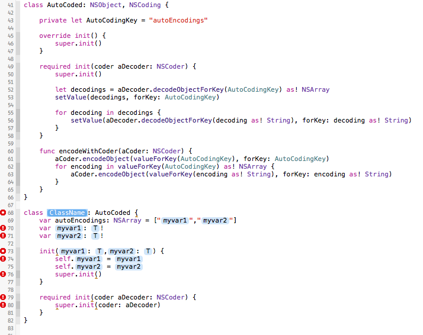

# AutoCoding
Easily have an object serialized and deserialized automatically in Swift

All you have to do is inherit from AutoCoded class and implement the autoEncodings var to specify which plist/primitive properties you'd like to be auto encoded.

### Implementation Example

```
class Person: AutoCoded, AutoCoding {
    var autoEncodings: NSArray = ["name","age"]
    var name: String!
    var age: NSNumber!

    init(name: String,age: NSNumber) {
        self.name = name
        self.age = age
        super.init()
    }
    
    required init(coder aDecoder: NSCoder) {
        super.init(coder: aDecoder)
    }
}
```

### NSKeyedArchiver Example
```
var bob = Person(name:"Bob", age:25)

// Archive
let data = NSKeyedArchiver.archivedDataWithRootObject(bob)

// Unarchive
if let person = NSKeyedUnarchiver.unarchiveObjectWithData(data) as? Person {
    println(person.name)
}
```

### Xcode Snippet ###
The easiest way to use this is with the snippet found in my [SwiftXcodeSnippets](https://github.com/koreyhinton/SwiftXcodeSnippets).
Copy [C9BF586F-7D6D-4687-A10C-0C78A867B795.codesnippet](https://github.com/koreyhinton/SwiftXcodeSnippets/blob/master/C9BF586F-7D6D-4687-A10C-0C78A867B795.codesnippet) to ~/Library/Developer/Xcode/UserData/CodeSnippets/.



